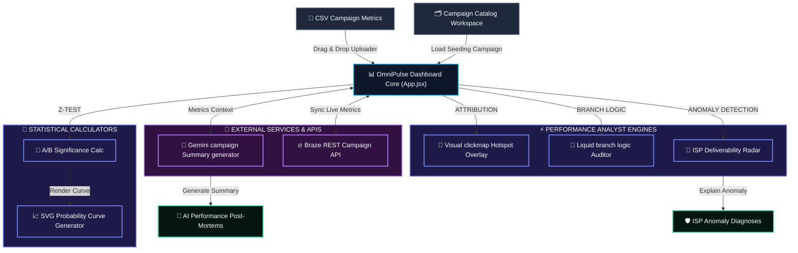

# OmniPulse ⚡
> **A post-deployment campaign analytics dashboard, multi-channel clickmap visualizer, and AI post-mortem assistant designed for lifecycle marketers and CRM developers.**

OmniPulse bridges the gap between campaign code/creative and post-send analytics by visualising click hotspots directly on template previews, auditing dynamic Liquid logic paths, and using generative AI to write performance post-mortem reports.

**Current product status:** OmniPulse is now structured as a daily-use campaign analysis workspace with clear data provenance. Seed campaigns are marked as demo data, CSV imports are marked as imported data, live Braze sync is routed through a serverless API when configured, and inferred diagnostics are labeled rather than presented as verified external checks.


---

## 🛠️ System Architecture & Data Flow



### Component Breakdown & Data Flow
1. **Inputs**: The application loads pre-seeded demo campaigns, parses imported campaign CSV logs locally, or syncs campaign statistics through the `/api/brazeCampaign` serverless route when Braze environment variables are configured.
2. **OmniPulse Core Controller (`App.jsx`)**: Distributes campaign details across the visual, branch-logic, and statistical calculator subpanels, while coordinating global report actions.
3. **Attribution & Logic Engines**: Connects clicks to specific absolute coordinates for visual hotspot rendering and logic blocks.
4. **A/B Significance Calculator**: Runs two-proportion Z-tests and plots coordinates for SVG probability curve overlays.
5. **AI Post-Mortem Integration**: Queries the `/api/gemini` serverless route with structured metric contexts to output qualitative summaries. A browser API-key fallback remains available for private local testing.

---

## 🚀 Key Features

### 1. Unified Master Overview & AI Post-Mortems
* **Dynamic Engagement Pulses**: Circular progress indicators calculating open rates, click-through rates, conversion rates, and unsubscribe rates.
* **AI Post-Mortem Summary Panel**: Integrates with Gemini through a serverless proxy to outline key findings, call out performance red flags, and highlight recommended adjustments.
* **Campaign-level Braze Sync**: Allows marketers to input a custom Braze Campaign ID and retrieve campaign totals through a server-side route. If credentials are absent, the app clearly marks the response as simulated.
* **Data Provenance Badges**: Labels reports as Demo Seed, Imported CSV, Live API, Simulated API, Inferred, or AI Draft so users know what can be trusted as source data.
* **Contextual Workflow Hints**: Shows tab-specific guidance for Overview, SQL Details, GA Diagnostics, and Settings so new users know what to add and where.
* **Filter Bars**: Filter statistics by Date Range, Channels (Email, Push, SMS, IAM), and Segment Cohorts.
* **Tab-Specific Global Actions**: Consolidates Save Snapshot, Print, and JSON export buttons in the header, exporting full reports for Combined Overview, database benchmarks for SQL CRM Details, or bounce/device splits for GA4 Diagnostics.
* **Report Archive Upserts**: Saves report snapshots to local storage and updates an existing report when the same report is saved again, avoiding duplicate archive cards.

### 2. Visual clickmap Attributions
* **Dynamic Hotspot Overlays**: Layers electric-cyan pulsing button dots directly on template previews.
* **Hover Tooltips**: Instantly displays unique click counts and CTR percentages upon hover.
* **Multi-Channel Previews**: Visualise click locations on HTML email templates, push notifications cards, SMS chat bubbles, or In-App Message takeover frames.

### 3. Liquid branch logic Auditor
* **Attribution by Expression**: Displays stats for dynamic conditional paths (e.g., segmenting Gold vs Silver vs Fallback code blocks).
* **Yield Rankings**: Ranks branch yield levels with color-coded badges indicating high-yield, normal, or underperforming logic blocks.

### 4. A/B Significance Calculator
* **Simulation Sandbox**: Type or override Sent volumes and Click conversions for two variants.
* **Statistical Significance**: Calculates Z-scores, p-values, lift percentages, and 95% confidence intervals.
* **Probability Overlap Curves**: Renders mathematically accurate overlapping density distribution curves using SVGs.

### 5. Deliverability Anomalies Radar & Ledger Hover Info
* **ISP Open-rate Deviations**: Flags email clients (Gmail, Outlook, Yahoo) whose open rates drop significantly below the campaign average.
* **Failures & Risk Audits Ledger**: Flags placement deviations, bounces, and branch underperformance from the loaded data. DNS authentication and reputation checks are marked as connector-required until a backend provider is configured.
* **AI Anomaly Explainer**: One-click prompt requesting Gemini to draft likely ISP filtering reasons based on visible campaign metrics.

---

## 💻 Tech Stack & Design

* **Core Framework**: React (Vite SPA)
* **Serverless API Routes**: Vercel-compatible `/api/gemini` and `/api/brazeCampaign`
* **Styling**: Vanilla CSS3 utility-token stylesheet
* **Icons**: Lucide React
* **AI Integration**: Google Gemini API (`gemini-2.5-flash`) through server-side environment variables
* **Statistical Algorithms**: Two-proportion Z-test and PDF normal distributions

---

## ⚙️ Quick Start & Installation

### Local Run
By default, the app runs with preloaded demo campaigns and clear source badges. CSV imports work locally; serverless Gemini/Braze routes require Vercel or equivalent API hosting.

1. Navigate to the directory:
   ```bash
   cd omnipulse
   ```
2. Install dependencies:
   ```bash
   npm install
   ```
3. Launch the development server:
   ```bash
   npm run dev
   ```
4. Open the localhost port allocated by Vite (usually `http://localhost:5173`) in your browser.

### Production Configuration
Set these environment variables in Vercel or your serverless host:

```bash
GEMINI_API_KEY=...
BRAZE_API_KEY=...
BRAZE_REST_ENDPOINT=https://rest.iad-01.braze.com
```

For private local testing only, the Settings panel still supports browser fallback keys. Do not use browser-stored API keys for shared production workspaces.
