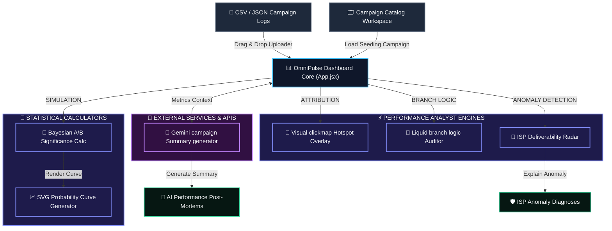

# OmniPulse ⚡
> **A post-deployment campaign analytics dashboard, multi-channel clickmap visualizer, and AI post-mortem assistant designed for lifecycle marketers and CRM developers.**

OmniPulse bridges the gap between campaign code/creative and post-send analytics by visualising click hotspots directly on template previews, auditing dynamic Liquid logic paths, and using generative AI to write performance post-mortem reports.


---

## 🛠️ System Architecture & Data Flow



### Component Breakdown & Data Flow
1. **Inputs**: The application loads pre-seeded historical campaigns or parses imported campaign event logs (CSVs/JSONs) locally.
2. **OmniPulse Core Controller (`App.jsx`)**: Distributes campaign details across the visual, branch-logic, and statistical calculator subpanels.
3. **Attribution & Logic Engines**: Connects clicks to specific absolute coordinates for visual hotspot rendering and logic blocks.
4. **Bayesian Calculator**: Runs standard proportion Z-tests and plots coordinates for SVG probability curve overlays.
5. **AI Post-Mortem Integration**: Queries the **Google Gemini API** with structured metric contexts to output qualitative summaries and deliverability anomaly debug audits.

---

## 🚀 Key Features

### 1. Unified Master Overview & AI Post-Mortems
* **Dynamic Engagement Pulses**: Circular progress indicators calculating open rates, click-through rates, conversion rates, and unsubscribe rates.
* **AI Post-Mortem Summary Panel**: Integrates with Google Gemini to outline key findings, call out performance red flags, and recommend adjustments.
* **Filter Bars**: Filter statistics by Date Range, Channels (Email, Push, SMS, IAM), and Segment Cohorts.

### 2. Visual clickmap Attributions
* **Dynamic Hotspot Overlays**: Layers electric-cyan pulsing button dots directly on template previews.
* **Hover Tooltips**: Instantly displays unique click counts and CTR percentages upon hover.
* **Multi-Channel Previews**: Visualise click locations on HTML email templates, push notifications cards, SMS chat bubbles, or In-App Message takeover frames.

### 3. Liquid branch logic Auditor
* **Attribution by Expression**: Displays stats for dynamic conditional paths (e.g., segmenting Gold vs Silver vs Fallback code blocks).
* **Yield Rankings**: Ranks branch yield levels with color-coded badges indicating high-yield, normal, or underperforming logic blocks.

### 4. Bayesian A/B Significance Calculator
* **Simulation Sandbox**: Type or override Sent volumes and Click conversions for two variants.
* **Statistical Significance**: Calculates Z-scores, p-values, lift percentages, and 95% confidence intervals.
* **Probability Overlap Curves**: Renders mathematically accurate overlapping density distribution curves using SVGs.

### 5. Deliverability Anomalies Radar
* **ISP Open-rate Deviations**: Flags email clients (Gmail, Outlook, Yahoo) whose open rates drop significantly below the campaign average.
* **AI Anomaly Explainer**: One-click prompt requesting Gemini to diagnose potential ISP filtering reasons.

---

## 💻 Tech Stack & Design

* **Core Framework**: React (Vite SPA)
* **Styling**: Vanilla CSS3 utility-token stylesheet
* **Icons**: Lucide React
* **AI Integration**: Google Gemini API (`gemini-2.5-flash`)
* **Statistical Algorithms**: Two-proportion Z-test and PDF normal distributions

---

## ⚙️ Quick Start & Installation

### Local Sandbox Run (Offline Simulator)
By default, the app runs in **Sandbox Demo mode**, allowing you to explore the dashboard immediately with default mock campaign data.

1. Navigate to the directory:
   ```bash
   cd omnipulse
   ```
2. Install dependencies:
   ```bash
   npm install
   ```
3. Launch the development server:
   ```bash
   npm run dev
   ```
4. Open the localhost port allocated by Vite (usually `http://localhost:5173`) in your browser.

### Live Configuration
1. Go to the **Settings & Imports** panel in the sidebar.
2. Enter your **Gemini API Key**.
3. Use the **Drag & Drop CSV Uploader** to import your own CRM campaign metrics sheets.
